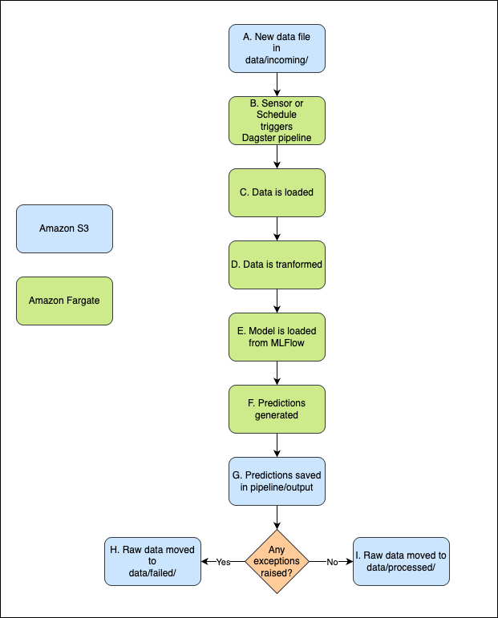

# MLOps Churn Model Assessment

## Introduction

This project demonstrates a robust MLOps workflow for operationalizing an XGBoost churn prediction model.
It has two main components:

- **Executable examples:** there are two executable scripts that present examples on how MLFlow experiment tracking and Dagster orchestration would work.
- **Mock/General Layout Design:** there are mock files and folders that illustrate how I'd design the and run the workflow in production. This includes two sample scripts for implementing a sensor and a schedule with Dagster, a folder structure for the whole project, and an architecture/pipeline diagram that explains how it would work.

If you have any questions or concerns, please feel free to reach to me at [urbdaniel.86@gmail.com].

Cheers,

[Daniel]

## How to Run Examples

1. **Set up the environment:**
   ```bash
   conda env create -f environment.yml
   conda activate mlops-churn
   ```

2. **Run MLflow experiment logging:**
   ```bash
   cd experiment
   python log_model_mlflow.py
   ```

3. **Run the Dagster pipeline:**
   ```bash
   cd ../pipeline
   python churn_pipeline.py
   ```

---

## Folder Structure
```
├── data/ # Input data and features
│ ├── failed/ # Stores files that triggered exceptions in the pipeline
│ ├── incoming/ # Folder monitored by sensor for new files
│ ├── processed/ # Stores files that were successfully processed by the pipeline
│ ├── feature_names_1.json
│ └── X_test_sample_1.json
├── model/ # Model artifacts
│ ├── xgb_churn_model_1.json
│ └── xgb_churn_model_1.bin
├── experiment/ # MLflow experiment tracking code/config
│ └── mlruns/ # MLflow tracking data
├── figures/ # Architecture diagrams
├── pipeline/ # Dagster code
│ ├── churn_pipeline.py # Main pipeline example
│ ├── churn_schedule.py # Schedule sample code
│ └── churn_sensor.py # Sensor sample code
├── infra/ # Infrastructure as code (Terraform)
│ └── (mock Terraform files)
├── data_eda.ipynb # Short notebook used to explore the provided data
├── environment.yml # Conda environment file
└── README.md # This file
```
---

## Architecture and Pipeline Diagram



---


## MLflow Experiment Tracking

- **Tracking URI:** Configured to use a relative path (`experiment/mlruns`) for portability.
- **Model Logging:** The XGBoost model is logged and registered with MLflow, including input/output signature for reproducibility.

---

## Dagster Orchestration

- **Pipeline:** Defined in `pipeline/churn_pipeline.py`, orchestrates data loading, transformation, model loading, prediction, and output. If run as it is, it'll take the provided sample data (X_test_sample_1.json) and generate predictions locally for testing purposes.
- **Scheduling:** (Bonus) `pipeline/churn_schedule.py` shows an example of a weekly schedule that triggers the pipeline.
- **Sensor:** (Bonus) `pipeline/churn_sensor.py` shows an example that would trigger the pipeline when a new file appears in `data/incoming/`.
---

## Model Serving

- **Batch Serving:** As it is, the pipeline is designed for batch prediction and can be run via bash. However, in production it would be triggered by new data (sensor) or on a schedule (weekly) as showed in the developed examples. I chose batch since there's no real-time need to get the predictions. I'd use metadata tagging for traceability and simplicity.
- **Versioning:** Each prediction output is timestamped and model version is tracked via MLflow.

---

## CI/CD & Infrastructure as Code

- **CI/CD:** As it is, GitHub holds the repository with all the neccesary components. In production, it'll be used for version control and standard CI/CD workflows.
- **IaC:** Example Terraform folder structure for provisioning MLflow backend and compute resources is provided.

---

## Decisions and Trade-offs

- **Batch vs. Real-time:** Chose batch for churn use case; real-time is possible, but doesn't seem necessary.
- **File-based Sensor:** it is simple and robust for demo, but in production, a schedule is more consistent.
- **Relative Paths:** Used for portability across environments.

---

## Assumptions

- Input data files have a consistent format.
- The folder structure is preserved when cloning/running the project.
- MLflow and Dagster are run locally for demo purposes, but the production workflow has only been laid out.

---

## Suggested Improvements

- Add advanced monitoring and alerting o every critical step and develop troubleshooting protocols.
- Improve error handling.
- Develop observability and retraining logic.